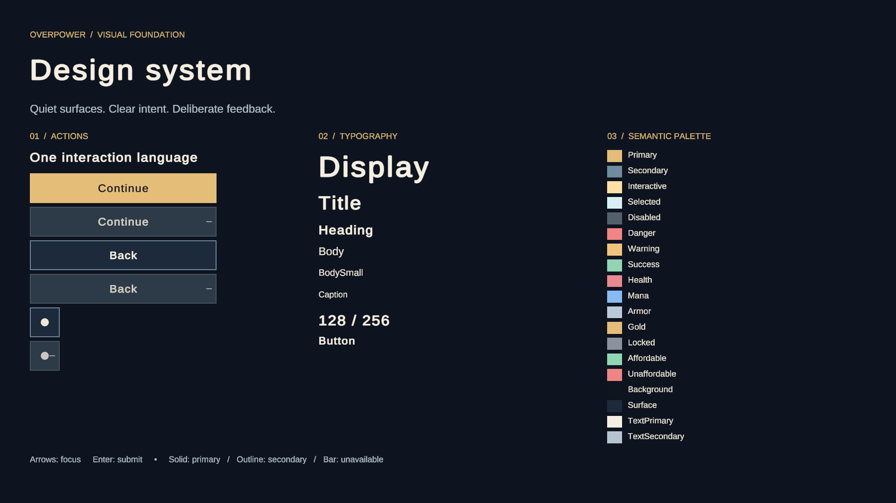

# Design System bootstrap validation

Scope: the first eight items of 0.3.1 (tokens, configuration and buttons).
The subsection remains open. Version stays 0.2.9; no 0.3.x tag is created.

## Reproduce

Open `OverPower/Assets/OverPower/Scenes/Development/DesignSystemPreview.unity`
in Unity 6000.3.14f1. Use the 1920×1080 Game view and enter Play Mode. The preview
uses the existing Input System UI module and Unity Localization, without Bootstrap
or Main Menu services. Arrow navigation, Enter submission and pointer interaction
use the ordinary EventSystem. Disabled controls are skipped by navigation.

Run the `OverPower.Tests.Unity` assembly in the Unity Test Runner (EditMode).
`DesignSystemButtonTests.Buttons_EventSystemAndLifecycle_RemainStable` enters real
Play Mode, sends EventSystem events and then exits. It covers initial keyboard
focus and arrow navigation past disabled controls, hover enlargement,
pressed compression, 30 rapid clicks for each family, return to neutral scale,
focus marking, Submit, disabled click/Submit rejection, disable/re-enable and
destruction while animating. Three prefab tests verify references, fonts and
absence of Missing Script components. These are automated interaction checks,
not a claim of a human usability study.

## Evidence

- Core: `dotnet restore OverPower.Core.sln`, Release build with `--no-restore`,
  and Release tests with `--no-build`; 292 passed (267 Domain, 15 Application,
  10 Infrastructure), no build warnings/errors.
- Unity: real open editor, no compiler errors; eight Unity tests passed, including
  the four Design System tests and existing localization/scene foundation tests.
- Visual: actual Unity camera renders at 1920×1080 inspected in English and French.
  Primary has the strongest filled treatment; Secondary is outlined; Icon has a
  64×64 click target. Disabled uses opacity plus an unavailable bar. Focus adds a
  side mark and emphasis; no overflowing French labels or missing accents observed.
- Prefabs and configuration were generated and saved through Unity's AssetDatabase
  and PrefabUtility, including normal Unity-generated `.meta` files.
- Opening the accepted baseline also generated missing `.meta` files for existing
  Domain/test sources. These are retained for GUID stability; no Domain/Application
  C# or gameplay behavior changed.

The TMP Liberation Sans font and neutral icon disc are documented temporary assets;
replacement requirements are in `DESIGN_SYSTEM.md`. Panels, badges, counters,
tooltips, modals, shared transitions and the Main Menu premium pass remain pending.
